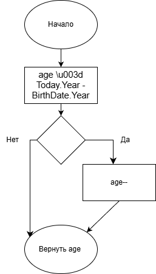

**Обновлено автоматически через GitHub Actions! 🚀**

var patient new Patient
{

    FullName \u003d \"Иванов Иван\",

    BirthDate \u003d new DateTime(2000, 1, 1)
};

int age = patient.CalculateAge();

Console.WriteLine($\"Возраст пациента: {age}\");

Логика расчета возраста реализована по следующей схеме:

var patient new Patient

{

    FullName \u003d \"Иванов Иван\",

    BirthDate \u003d new DateTime(2000, 1, 1)

};

int age = patient.CalculateAge();

Console.WriteLine($\"Возраст пациента: {age}\");

Логика расчета возраста реализована по следующей схеме:

var patient new Patient

{

    FullName \u003d \"Иванов Иван\",

    BirthDate \u003d new DateTime(2000, 1, 1)

};

int age = patient.CalculateAge();

Console.WriteLine($\"Возраст пациента: {age}\");

Логика расчета возраста реализована по следующей схеме:

.
